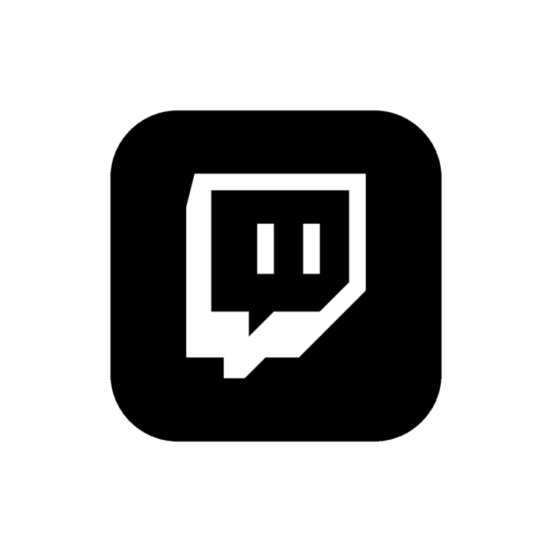
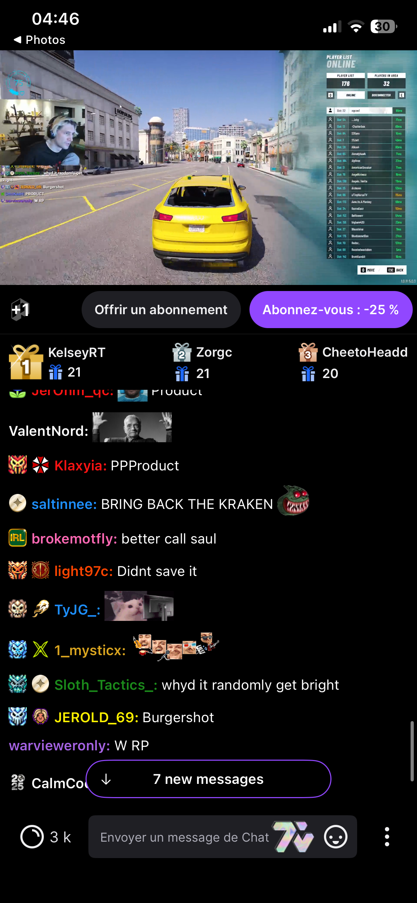
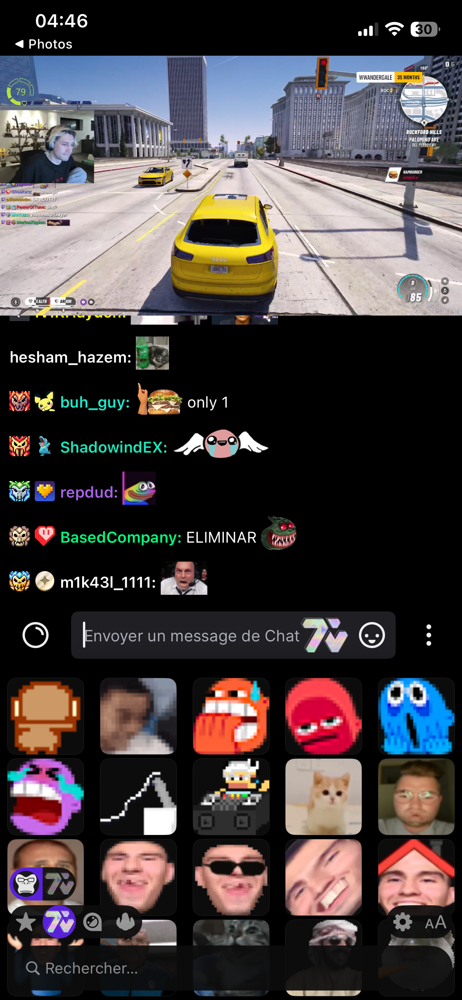
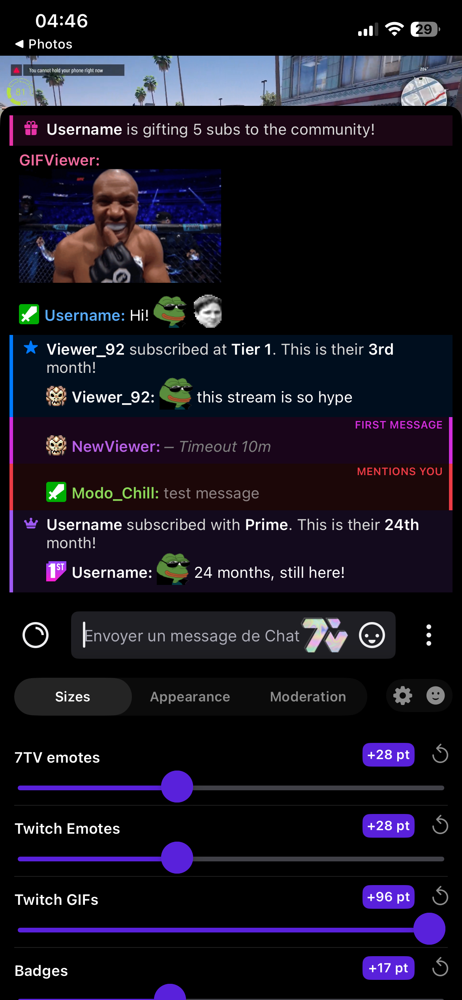
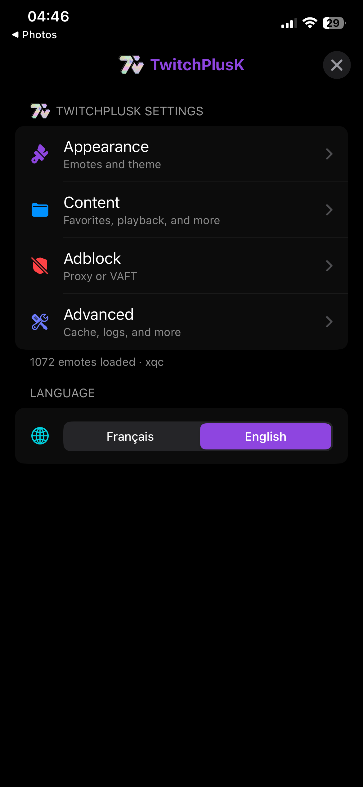
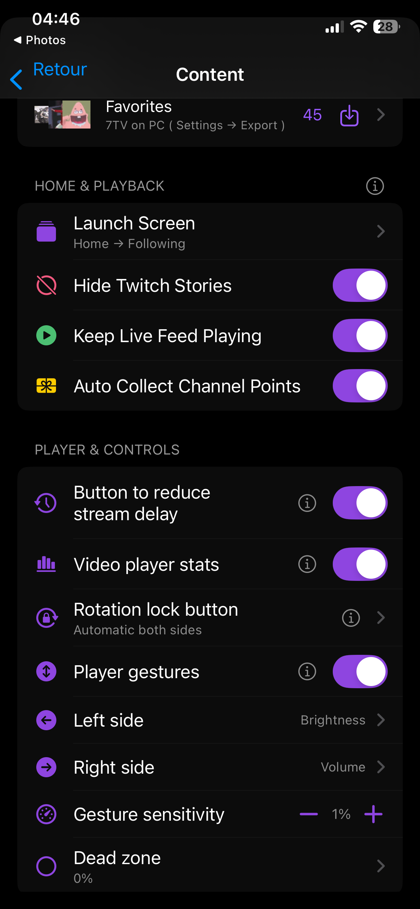

  

<h1 align="center">TwitchPlusK</h1>

  A better Twitch experience for iOS.

  
  
  

  <a href="https://github.com/Knoks1111/TwitchPlusK/releases">Releases</a> ·
  <a href="CHANGELOG.md">Changelog</a> ·
  <a href="LICENSE">License</a>

  
  
  
  
  

TwitchPlusK is a tweak for the official Twitch iOS app. It keeps the native app and adds a fully customizable chat, 7TV/BTTV/FFZ emotes, adblock, Channel Points Auto Claim, OLED mode and more.

Prebuilt IPAs are available in [Releases](https://github.com/Knoks1111/TwitchPlusK/releases) and can be installed with SideStore or LiveContainer.

Available in  **ENGLISH** and  **FRENCH** from the Settings menu.

Full CHANGELOG : [CHANGELOG.md](https://github.com/Knoks1111/TwitchPlusK/blob/main/CHANGELOG.md)

## What it does

### Chat and emotes

- Provides a fully customizable chat renderer that supports Twitch's native chat features while adding extras such as first-time chatter highlighting and more.
- Adds **7TV, BTTV, and FFZ emotes** to Twitch chat with a custom emote picker.
- Supports favorites, animated emotes, Zero-Width emotes, replies, and threads.

### Ad blocking

- Includes two different AdBlock methods:
  - **Proxy** — uses a default or custom video proxy.
  - **Local (VAFT)** — uses a local ad-blocking engine without a video proxy.

### App customization

- Adds **OLED Mode**, launch screen controls, Stories hiding, Live Feed continuity, Orientation Lock, and more.
- Includes settings export/import, automatic **Channel Points Auto Claim**, and more.

## Install

1. [Download the latest IPA](https://github.com/Knoks1111/TwitchPlusK/releases/latest)
2. Install it with SideStore or LiveContainer 

New releases follow new Twitch app versions — check the Releases page when Twitch updates.

## Build it yourself

If you want to build from source instead of using the prebuilt release:

1. Fork this repository.
2. Go to the **Actions** tab of your fork.
3. Run **Build Dylib** first — this compiles the tweak and produces a `.dylib` artifact.
4. Once it finishes, open the run and copy the link to the `.dylib` artifact.
5. Run **Build IPA (final)** and, when prompted, paste:
   - the `.dylib` artifact link from step 4
   - a direct download link to a Twitch IPA
6. Once it finishes, the patched IPA is published directly to your fork's Releases page.
7. Install it with SideStore or LiveContainer
## Legal

Educational project. Using modified apps may violate Twitch's Terms of Service. Use at your own risk.
